# DiffusionWorks: Stochastic Derivatives Numerics

**A C++ Stochastic Derivatives Modeling and Validation Engine**

Vatsal Maniar — <https://github.com/VM25>

---

## Abstract

DiffusionWorks is a C++20 engine for pricing and validating equity derivatives under the
Black–Scholes–Merton and Heston models, together with a programme of fifteen numerical
experiments that measure what the engine actually does rather than what the theory
promises. Instruments span European, arithmetic and geometric Asian, and knock-out
barrier options. Methods span exact and discretised Monte Carlo simulation, variance
reduction, finite-difference PDE solution, four families of Greek estimator,
characteristic-function pricing, and Levenberg–Marquardt calibration.

The central claim is not that the engine is fast, and it is not that every method works.
It is that every number the project publishes is reproducible from a committed artifact,
and that the places where the numerics *fail or fall short* are measured, published, and
kept. Of the fifteen experiments, ten pass and five carry warnings. The warnings are the
substance of the contribution: a pre-asymptotic convergence fit that would flatter the
scheme if quoted from its full range; a closed-form barrier reference that this project
shows to be measurably wrong in one of the two geometries it is normally applied to; a
discretisation whose bias decays measurably in one regime and is unresolvable in another;
a real market surface that every calibration scenario fits well and none of them
identifies; and a nominal 95% confidence interval that covers 87.75% where the payoff is
severely skewed and the sample is small.

All fifteen records were regenerated in a single pass from stored configurations at
generator commit `3846fb3` on a clean tree. Every record embeds that commit, its compiler,
flags, and hardware. Every figure regenerates from a committed record; every headline
number in this paper is re-derived from the records mechanically by
[`python/verify_claims.py`](../python/verify_claims.py).

---

## 1. Scope and project identity

DiffusionWorks is a **modeling and validation engine**. Its purpose is to demonstrate
quantitative implementation in C++ where the numerical claims are auditable end to end.
The full statement of identity is [`PROJECT-IDENTITY.MD`](PROJECT-IDENTITY.MD); the
governing scope is [`PROJECT-SPEC.MD`](PROJECT-SPEC.MD) and
[`PRODUCT-SPEC.MD`](PRODUCT-SPEC.MD).

**In scope.** Model implementation, pricing engines, simulation, variance reduction,
PDE solution, Greeks, implied volatility, calibration, statistical validation, a
deterministic multithreaded execution layer, and the experiment programme.

**Explicitly out of scope.** Performance measurement of any kind. An earlier revision of
this project carried a benchmarking-and-optimization phase; it was removed in full, along
with its tooling, dependencies, evidence, and documentation. Multithreading is retained
solely for *deterministic reduction and race-safety* — that threads do not change an
answer — and never as a claim about how quickly anything runs. Where a runtime appears in
a record it is a non-gating diagnostic and never determines a status, a ranking, or a
headline. [`ADR-025` and `ADR-026`](ARCHITECTURE-DECISIONS.MD) record the withdrawal.

This matters to one experiment in particular. EXP-05 compares variance-reduction
estimators by **work-normalised statistical efficiency** — the reciprocal of variance
times deterministic work units counted from the configuration and the estimator (path-leg
simulations, arithmetic and geometric payoff evaluations, the antithetic pair cost, the
control-variate pilot) — rather than by anything measured on a clock. The ranking is
therefore a property of the estimators, reproducible on any machine. See
[`VARIANCE-REDUCTION-METHODOLOGY.md`](VARIANCE-REDUCTION-METHODOLOGY.md).

**Python boundary.** Python is used only for plotting, aggregation, and checking. It
computes no result that appears in a record. QuantLib appears only as an external
validation oracle, never in a pricing path.

---

## 2. Mathematical models and instruments

The complete specification — every equation, convention, and boundary condition — is
[`MATHEMATICAL-SPEC.MD`](MATHEMATICAL-SPEC.MD). This section states the conventions the
rest of the paper depends on.

### 2.1 Market and conventions

A single-asset market carries spot `S₀ > 0`, continuously compounded risk-free rate `r`,
and continuous dividend yield `q`. Time is in years. All pricing is under the risk-neutral
measure `Q`; discounting is `e^{−rT}`. Volatilities are annualised. The forward is
`F = S₀e^{(r−q)T}`.

### 2.2 Black–Scholes–Merton

Under `Q`, `dS_t = (r − q)S_t dt + σS_t dW_t`, with the closed-form European call and put,
and the eight first- and second-order Greeks, given in
[`MATHEMATICAL-SPEC.MD`](MATHEMATICAL-SPEC.MD) §2–3. The analytic values are the reference
against which the simulated and PDE engines are scored.

### 2.3 Heston

The variance follows a CIR process correlated with the spot:

```text
dS_t = (r − q) S_t dt + sqrt(v_t) S_t dW_t^S
dv_t = kappa (theta − v_t) dt + xi sqrt(v_t) dW_t^v
d<W^S, W^v>_t = rho dt
```

The **Feller condition** `2κθ ≥ ξ²` determines whether the variance process can reach
zero. This project treats a Feller violation as a *regime to be priced and measured*, not
as an invalid input: violating parameter sets are priced, their bias measured, and their
uncertainty attached. Pricing uses the characteristic function in its "little trap"
formulation, integrated by Gauss–Legendre quadrature; see
[`HESTON-PRICING-METHODOLOGY.md`](HESTON-PRICING-METHODOLOGY.md).

### 2.4 Instruments

European call and put; arithmetic-average Asian call and put; the geometric Asian, which
has a closed form and serves as the control variate for its arithmetic counterpart; and
down-and-out and up-and-out barrier calls under continuous, discrete, and
Brownian-bridge monitoring conventions. Payoffs are in
[`MATHEMATICAL-SPEC.MD`](MATHEMATICAL-SPEC.MD) §5.

Monitoring convention is part of the instrument, not a solver setting. A discretely
monitored barrier is a *different contract* from a continuously monitored one, and EXP-07
measures exactly how different.

---

## 3. Numerical methods

### 3.1 Simulation and discretisation

Geometric Brownian motion is simulated by exact log-transition sampling where the
distribution is known, and by Euler–Maruyama and Milstein where a discretisation is under
study. Heston variance is simulated by **full-truncation Euler**: the variance is floored
at zero for the diffusion coefficient while the drift retains the un-truncated value.
EXP-10 measures the consequences against a naive scheme that feeds the raw, possibly
negative variance into the square root.

Randomness is a counter-based Philox stream, so a path's draws depend only on its index
and the master seed, never on scheduling. This is what makes a threaded run reproduce a
serial one bit for bit; see [`MULTITHREADING-METHODOLOGY.md`](MULTITHREADING-METHODOLOGY.md).

### 3.2 Variance reduction

Antithetic sampling, a geometric-Asian control variate with a pilot-estimated coefficient,
and their combination. The control's own expectation is checked against its closed form
before use — the validation passes at all six cells, each within one standard error.

### 3.3 Finite differences

The Black–Scholes operator is discretised on a uniform grid in `S` with explicit,
fully implicit, and Crank–Nicolson time stepping, plus an optional Rannacher start-up of
two implicit steps. Barrier contracts are solved on the live index range of the `[0, S_max]`
grid with an absorbing boundary at the barrier — a design chosen so the operator keeps its
exact `i²` form; see [`PDE-CONVERGENCE-METHODOLOGY.md`](PDE-CONVERGENCE-METHODOLOGY.md).

Spatial and temporal orders are measured **separately**, each with the other's error driven
down and the premise then verified, because a joint sweep measures a mixture and not an
order. That methodology note records the first attempt getting this wrong.

### 3.4 Greeks

Analytic; central finite differences under common random numbers; pathwise
differentiation; and the likelihood-ratio (score-function) method. Their trade-offs are
regime-dependent and are reported per cell rather than ranked; see
[`GREEKS-METHODOLOGY.md`](GREEKS-METHODOLOGY.md).

### 3.5 Implied volatility and calibration

Implied volatility is inverted by a bracketed Newton iteration with bisection fallback.
Heston calibration minimises a weighted implied-volatility or price objective by
Levenberg–Marquardt from multiple starts, with parameter bounds enforced by penalty and
the penalty reliance reported. See
[`CALIBRATION-METHODOLOGY.md`](CALIBRATION-METHODOLOGY.md).

---

## 4. Software architecture and reproducibility

The full design is [`TECHNICAL-DESIGN.MD`](TECHNICAL-DESIGN.MD); decisions and their
rejected alternatives are [`ARCHITECTURE-DECISIONS.MD`](ARCHITECTURE-DECISIONS.MD).

### 4.1 Layering

```text
Configuration (JSON, schema-versioned)
    ↓
CLI command  (price | simulate | greeks | validate | experiment | calibrate)
    ↓
Instrument + MarketState + Model          <- value types, validated at construction
    ↓
Pricing / Simulation / Calibration engine <- no I/O, no CLI, no plotting
    ↓
Statistics + Validation + Diagnostics
    ↓
JSON record / CSV summary / console
```

The numerical core has no dependency on the CLI, on plotting, on QuantLib, or on the
results site specified for a later phase and not built at the time of writing. Errors are
values: every fallible operation returns `Result<T>`, and no engine throws across an API
boundary. An engine that cannot produce a trustworthy number **refuses** and says why,
rather than returning a plausible one.

The API reference is the annotated headers themselves: all **58 public headers** under
`include/` carry `///` documentation, and [`python/check_docs.py`](../python/check_docs.py)
enforces that rather than asserting it. Doxygen is a permitted dependency and is not used;
a renderer nobody runs would not document the declarations better than the declarations do.

### 4.2 Experiment records

Every experiment returns one `ExperimentRecord`, serialised to `results/EXP-NN.json`:

| Field | Meaning |
| --- | --- |
| `id`, `name`, `question` | what was asked |
| `status` | `pass`, `warning`, `fail`, or `inconclusive` — a claim about the *finding* |
| `interpretation` | what the numbers mean, in prose |
| `limitations` | what this run does **not** establish; never empty |
| `reproduction_command` | the exact command that regenerates it |
| `configuration` | the stored configuration, including the seed policy |
| `results` | the full structured measurements |
| `table` | the summary table, serialised to `EXP-NN.csv` |
| `runtime_seconds` | non-gating diagnostic |
| `build_metadata` | compiler, version, flags, git commit, dirty flag, hardware |

`status` deserves emphasis. It describes **what was measured, not whether the run
completed**. An experiment does not earn a `pass` for successfully discovering a
limitation; if it did, the status would describe the harness rather than the finding.
Four experiments were corrected on exactly this point before the final artifact set was
generated.

### 4.3 Reproducibility

Reproduction of any record:

```bash
./build/release/src/diffusionworks experiment \
    --config configs/experiment/convergence.json --id EXP-02 \
    --output results/EXP-02.json
```

Each record names its own `reproduction_command`. The CSV summary is **derived from the
record**, not produced by a second run:

```bash
python3 python/derive_csv.py results/EXP-02.json
```

This is not a stylistic choice. Invoking the CLI with `--format csv` re-runs the
experiment, so a CSV produced that way describes a *different execution* than the JSON
beside it and disagrees with it on every runtime column. Deriving the summary from the
record's own table makes the pair provably one run.

Figures, all of which regenerate from committed records:

```bash
python3 python/plot_convergence.py results/EXP-*.json --outdir docs/figures
python3 python/plot_experiments.py results/EXP-*.json --outdir docs/figures
```

Both plotters are reporting only: every number they draw is read from a record and never
recomputed, so a plotting bug cannot change a published result.

The artifact set is inventoried in [`results/MANIFEST.json`](../results/MANIFEST.json),
which carries the generator commit and a SHA-256 for every record, CSV, and figure. Its
`artifact_commit` field is null by construction — a manifest cannot name the commit that
adds it, and back-filling it would change the file its own checksums cover.

Determinism rests on a pinned floating-point policy: the project builds with
`-ffp-contract=off` because contraction changes answers, and a slope produced under
different flags is a different result. See
[`FLOATING-POINT-POLICY.md`](FLOATING-POINT-POLICY.md).

### 4.4 Checks

```bash
python3 python/generate_manifest.py --check   # artifact completeness
python3 python/verify_claims.py               # prose re-derived from records
python3 python/check_docs.py                  # links, figure references, scope
ctest --test-dir build/release                # 793 tests
```

CI runs twelve jobs: GCC and Clang in debug and release, ASan+UBSan, TSan, a QuantLib
cross-validation build, clang-format, clang-tidy, include hygiene, reference-fixture
verification, and the experiment-reproduction job that re-runs the fast experiments,
checks every committed record for required artifacts, and confirms every committed figure
regenerates.

---

## 5. Validation methodology

The plan is [`VALIDATION-PLAN.MD`](VALIDATION-PLAN.MD); the catalogue of ways a numerical
project fools itself is [`FAILURE-MODES.MD`](FAILURE-MODES.MD). Four principles govern
every experiment.

**Evidence is separated by kind.** External references (published values, independently
generated high-precision values, QuantLib), analytic invariants (put–call parity,
limiting cases), and internal numerical checks (quadrature convergence, refusal handling)
are reported in distinct categories. They are *not* all independent oracles, and the
records do not present them as such. No single oracle is load-bearing.

**Nothing unresolved is fitted.** A quantity is *resolved* only when it clears a stated
multiple of its own across-seed standard error. Below that threshold the experiment
reports the quantity as unresolved rather than fitting a slope to sampling noise. A
power-law fit will return a confident-looking interval for pure noise, which is precisely
why the refusal is mechanical rather than discretionary. EXP-07 and EXP-10 both exercise
this.

**Both fits are published where they disagree.** A theoretical order is an asymptotic
statement, so a full-range fit over coarse levels is not wrong, it is a faithful
description of a curve that is not a straight line. Where the full-range and
asymptotic-window fits disagree, both are published and the disagreement is the finding.

**Failures are preserved.** A disappointing or failed outcome is a result. It is kept in
the record with its evidence, not removed, re-run until it improves, or smoothed into a
pass.

Tolerances are tiered by what is being compared — bit-exact for analytic identities,
statistical for sampled quantities — and are stated in
[`VALIDATION-PLAN.MD`](VALIDATION-PLAN.MD) §20.

---

## 6. Results: EXP-01 through EXP-15

Fifteen experiments, defined in [`EXPERIMENT-CATALOG.MD`](EXPERIMENT-CATALOG.MD),
regenerated in one pass at generator commit `3846fb3`. **Ten pass, five carry warnings,
none fail.** The reconciliation table, with headline for each, is
[`results/README.md`](../results/README.md).

### 6.1 Sampling and discretisation convergence (EXP-01 – EXP-04)

**EXP-01 — Monte Carlo sampling convergence** (`pass`). Root-mean-square pricing error
across independent seeds decays as `N^{−1/2}` in all eight scenarios; every fitted slope's
95% interval covers −0.5.

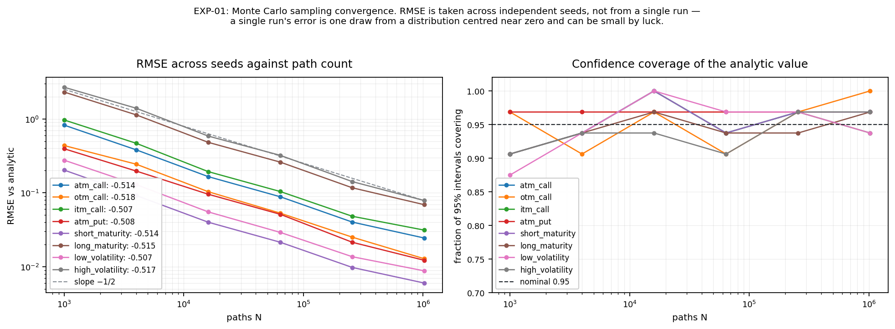

**EXP-02 — Strong SDE convergence** (`warning`). Euler–Maruyama attains strong order ½ and
Milstein order 1 in the asymptotic window (0.4996 and 0.9957). The full-range fits fall
short (0.4974 and 0.9838) because the coarse levels are pre-asymptotic. The local orders
climb monotonically toward theory as the grid refines, which is what distinguishes this
from a wrong order — see §8.

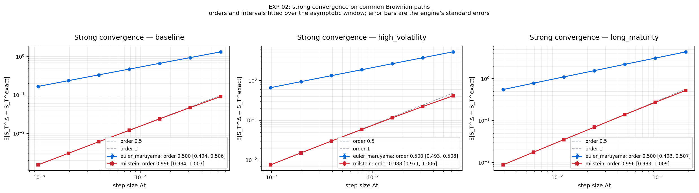
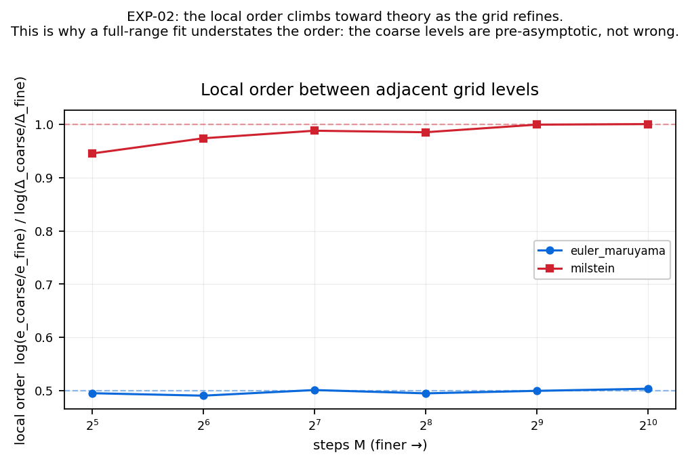

**EXP-03 — Weak SDE convergence** (`pass`). Both schemes converge weakly at order 1
against `f(S)=S` (0.9999) and `f(S)=S²` (0.9996 Euler, 0.9997 Milstein), where the error is
available in closed form. On the call payoff the orders are 0.9154 and 0.9897, the lower
figure reflecting a non-smooth test function. Euler and Milstein share their first moment
*exactly*, which the record verifies rather than assumes.

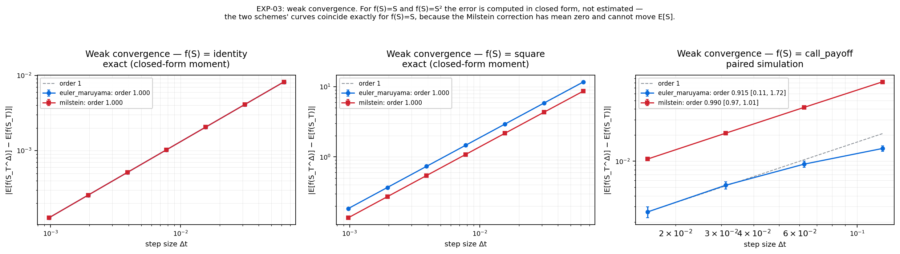

**EXP-04 — Sampling error versus discretisation bias** (`pass`). The bias floor exists and
is located: of 48 cells, 10 are bias-dominated, 29 sampling-dominated, and 9 mixed. On
coarse grids additional paths stop improving accuracy, because the error is dominated by a
discretisation bias that no number of paths reduces.

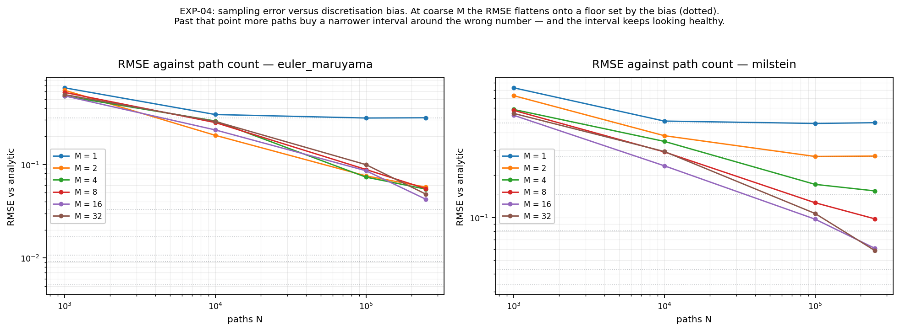

### 6.2 Variance reduction (EXP-05)

**EXP-05 — Work-normalised variance-reduction efficiency** (`pass`). Measured as
reciprocal variance times deterministic work units, not against a clock. On the arithmetic
Asian the geometric control variate is worth roughly **1730×** crude sampling; on the
European, where no such control exists, antithetic sampling is worth about **3.3×**. The
control's own expectation is validated against its closed form at every cell before it is
used.

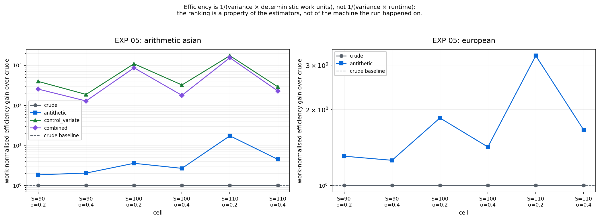

### 6.3 Finite differences (EXP-06)

**EXP-06 — PDE stability and grid convergence** (`pass`). Crank–Nicolson reaches order
**2.0034** in space. In time, the implicit scheme is first order (1.0006), plain
Crank–Nicolson's full-range fit is inflated to 3.5508 by coarse-grid oscillation against
an asymptotic-window value of 1.9204, and two Rannacher start-up steps restore a clean
**1.9838**. The explicit scheme's stability bound is shown to be *sufficient but not
necessary*: it is stable to Courant ratio 1.5 and divergent at 2.

The plain-Crank–Nicolson pathology is disclosed, its cause identified (the payoff kink is
non-smooth data and the amplification factor tends to −1 for the highest modes), and its
remedy measured in the same record. That is a completed experiment, not an unresolved
defect, which is why it stands at `pass`.

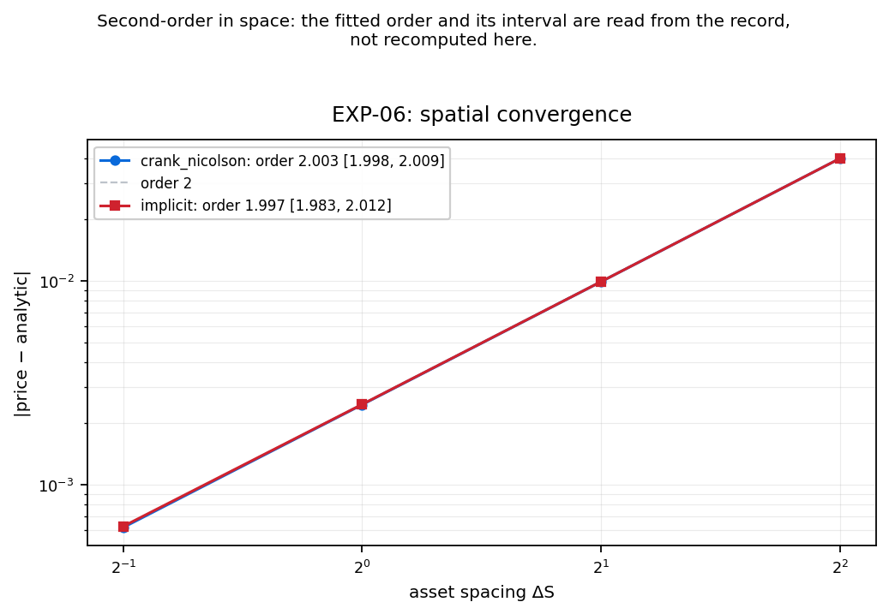
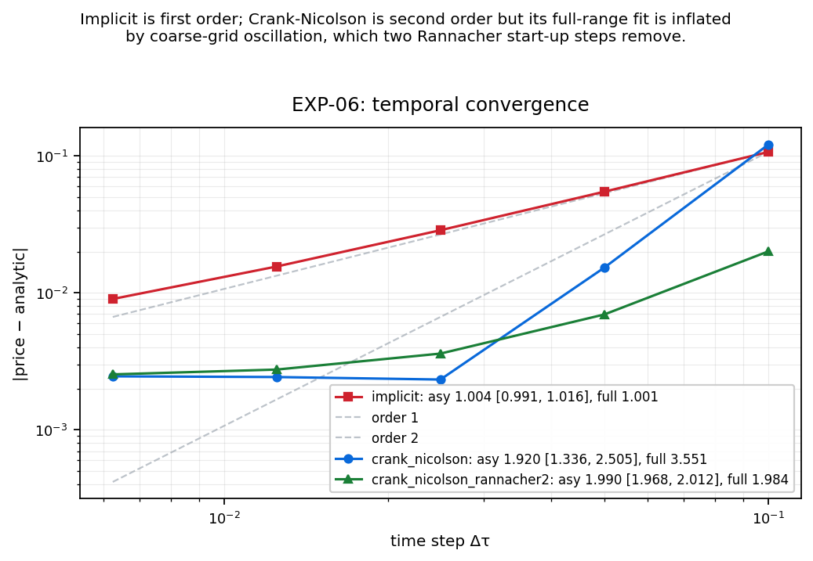
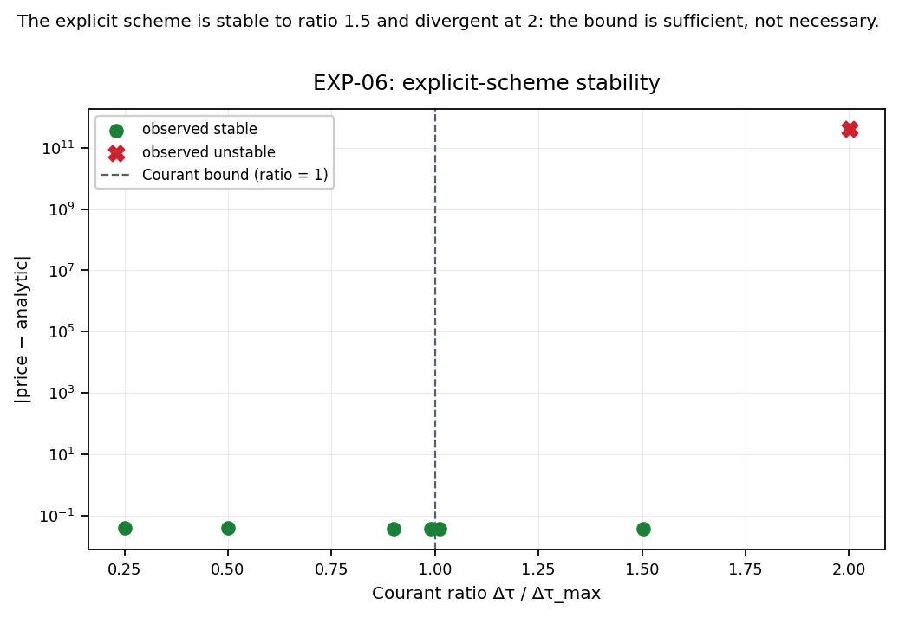

### 6.4 Barrier monitoring (EXP-07)

**EXP-07 — Barrier monitoring bias** (`warning`). Daily monitoring is not continuous
monitoring: for an up-and-out call struck near the spot the discrete price exceeds the
continuous one by **67%** at daily frequency and by **792%** at the coarsest frequency
tested. The Brownian-bridge correction removes the bias at every frequency in both
directions. A separate PDE arm prices the continuous contract directly and converges at
order ~2. The two warnings this experiment carries are in §8.

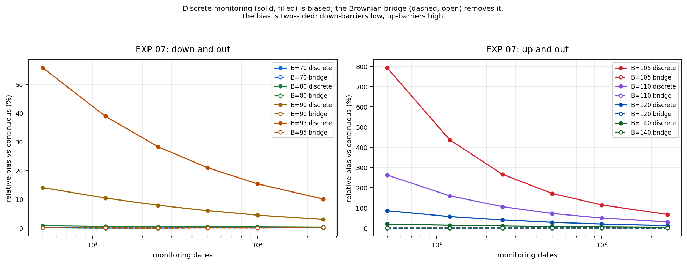
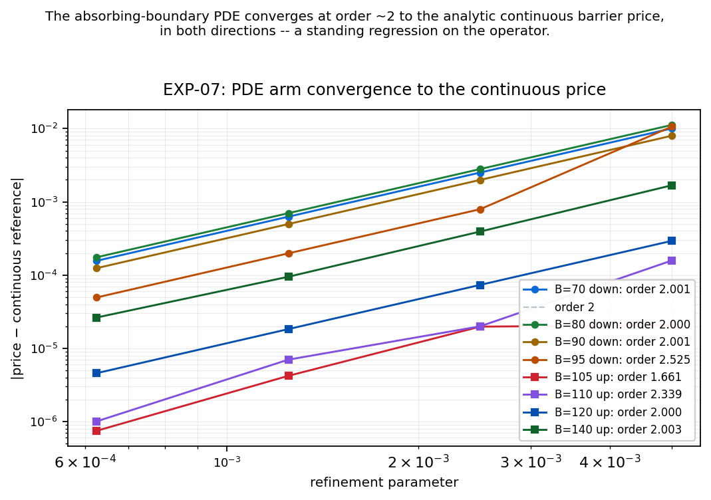

### 6.5 Greeks (EXP-08)

**EXP-08 — Greek estimator comparison** (`pass`). No estimator wins everywhere, and the
record declines to name one. Its headline is a correction to a textbook heuristic: under
**common random numbers** the finite-difference variance does not grow as `1/h` for delta
or `1/h²` for gamma, because the shared-draw difference quotient converges path by path to
the pathwise derivative. The measured dispersion-versus-bump exponent has median **0.01**
for delta (textbook: 1) and **0.53** for gamma (textbook: 2). Pathwise delta has the
smaller standard error in every cell — about **2.4×** at the median, widening to roughly
250× in the deep out-of-the-money short-maturity corner — but has no gamma at all, and
likelihood-ratio is the only estimator here that survives a discontinuous payoff.

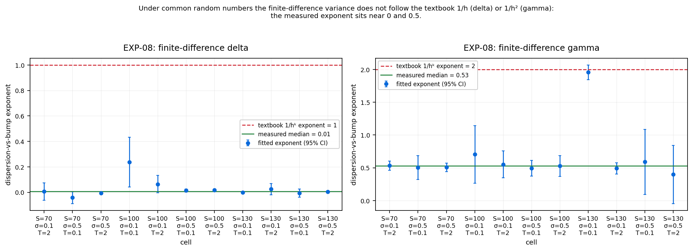
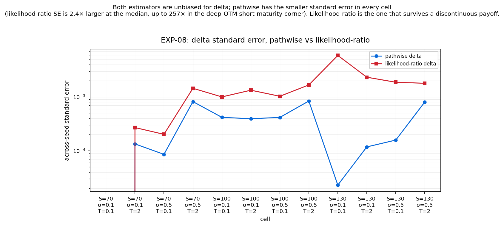

### 6.6 Heston characteristic function and simulation (EXP-09, EXP-10)

**EXP-09 — Characteristic-function validation** (`pass`). The characteristic function is
tested directly, not only through the prices it produces: `φ(0)=1` and conjugate symmetry
hold to exactly zero, the martingale identity `φ₂(−i) = S₀e^{(r−q)T}` holds to
**5.6e−16** relative, and the function is finite and continuous across 162 parameter
regimes spanning Feller-satisfying and Feller-violating sets. Quadrature converges to
machine precision. Prices reproduce one published COS-method value and four independently
generated high-precision references to about 1e−15 relative. The evidence categories are
kept apart: one published reference, four independently generated, and the internal
convergence check — they are not five independent oracles.

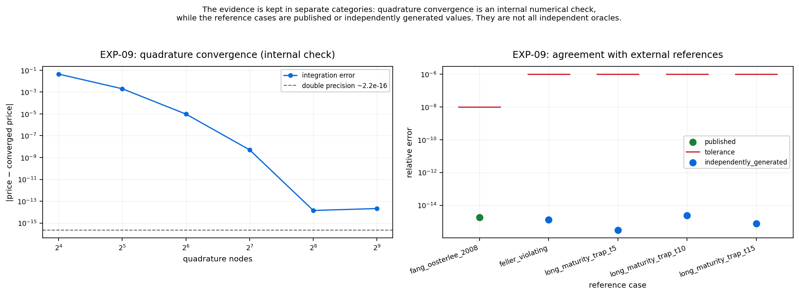

**EXP-10 — Heston variance discretisation** (`warning`). Full truncation prices every
regime tested without a single non-finite path, while the unguarded naive Euler scheme
fails to produce a price at any step count in either regime. The remaining full-truncation
bias decays at order **1.09** in the Feller-violating regime. In the Feller-satisfying
regime the bias never clears the sampling noise, so no order is fitted — the reason for
the warning, in §8.

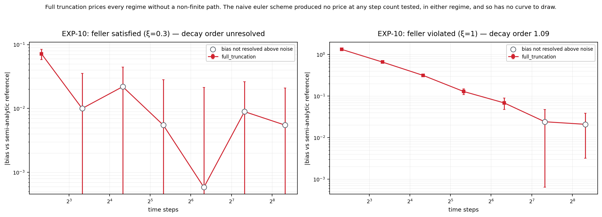

### 6.7 Cross-method agreement and statistical validity (EXP-13 – EXP-15)

**EXP-13 — Cross-method accuracy and agreement** (`pass`). Analytic, crude Monte Carlo,
antithetic Monte Carlo, and Crank–Nicolson finite differences agree on every European
cell, the largest disagreement being 0.54 combined standard errors. Heston Monte Carlo
agrees with the characteristic-function price in all four cells (0.08–0.83σ), in
Feller-satisfying and Feller-violating regimes alike. The arithmetic-Asian estimators agree
pairwise in every cell. Methods are compared in units of their own combined standard error,
so a disagreement is judged against sampling noise rather than an absolute tolerance.

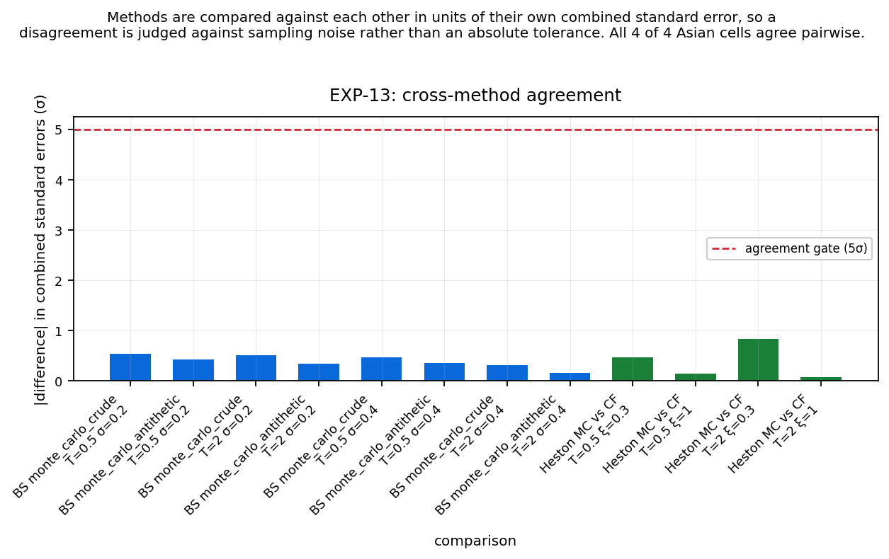

**EXP-14 — Statistical confidence coverage** (`warning`). At the large sample the observed
coverage of the nominal 95% interval sits within a couple of its own standard errors at
every moneyness, including a severely right-skewed deep out-of-the-money call. At N=2,000
with payoff skewness 17.3 it covers **87.75%**, **4.4** standard errors below nominal. See §8.

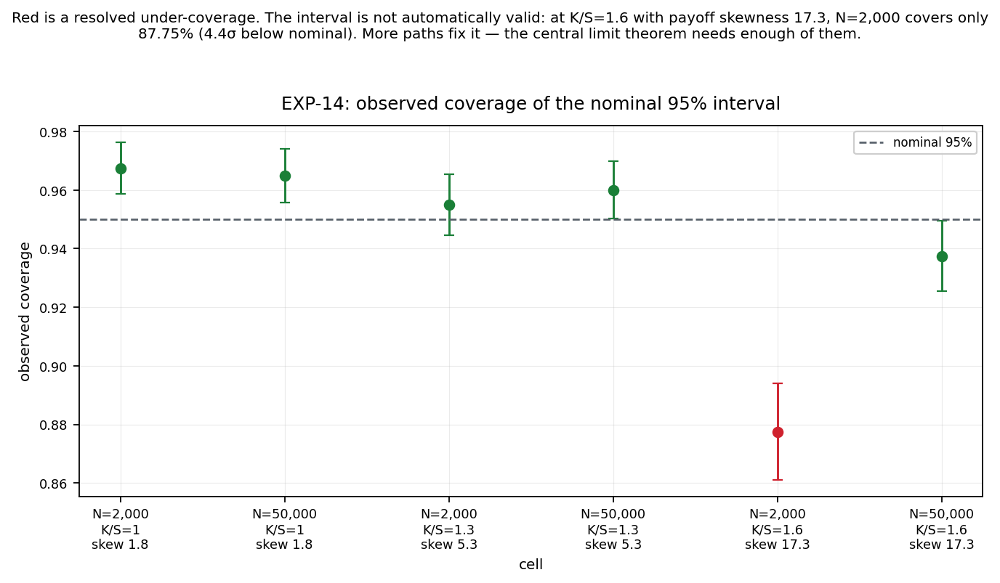

**EXP-15 — Numerical edge cases** (`pass`). **21 of 21** edge cases either produce the
correct limiting value or refuse explicitly with a typed error. No non-finite value escapes
any engine. Refusing is a correct outcome here: a plausible-looking number from a
degenerate input would be the failure.

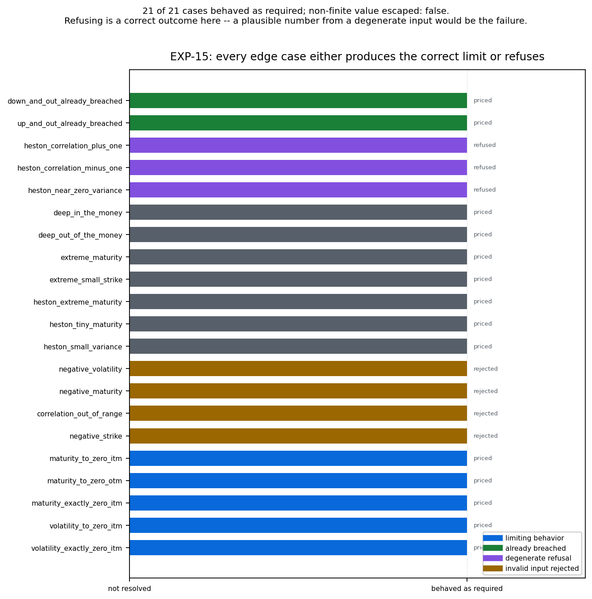

---

## 7. Heston calibration and the real-surface finding

Two calibration experiments are deliberately paired, and the contrast between them is the
point.

**EXP-11 — Synthetic recovery** (`pass`). A surface is generated from known Heston
parameters and the calibrator is asked to recover them. It does: normalised parameter
distance 2.0e−10, implied-volatility RMSE 1.8e−11, with **4 of 4** starts converging and no
competing fit at materially different parameters. Crucially the headline is read from a
**blind** start — one that did not begin at the answer. A start seeded at the truth
recovering the truth would prove nothing about calibration.

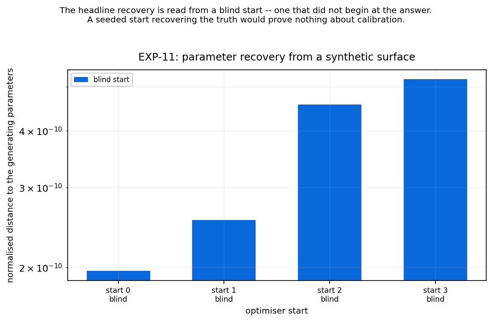

**EXP-12 — Market-surface stability** (`warning`). The same calibrator is pointed at a real
SPY option surface with documented provenance and timestamp: 18 quotes across three
maturities, none excluded by the validation filters. Seven scenarios vary the initial
guess, the quote weighting, the parameter bounds, and the strike/maturity subset. **All
seven converge, and all seven fit**, with implied-volatility RMSE from 0.0015 to 0.0106,
and no scenario leaning on a bounds penalty.

A reader stopping there would conclude the model was pinned down. It is not. Across those
same seven scenarios:

| Parameter | Spread across scenarios | Relative dispersion |
| --- | --- | --- |
| Correlation `ρ` | −0.72 to −0.55 | 10% |
| Initial variance `v₀` | 0.020 to 0.028 | 11% |
| Vol-of-variance `ξ` | 0.70 to 1.63 | 31% |
| Long-run variance `θ` | 0.038 to 0.496 | **95%** |
| Mean reversion `κ` | 0.26 to 11.21 | **145%** |

The parameters governing the short end are determined by this surface. The pair governing
the long-run variance level is not: `κ` and `θ` trade off against each other along a valley
the data does not resolve, and a surface of three maturities carries little information
about a long-run level. **A good fit is not an identified parameter set.**

This is why the record reports objective value, surface fit, parameter dispersion, and
penalty reliance as four *separate* findings. Collapsing them into "the calibration
converged" would state the one that is true and hide the one that matters. The difference
between EXP-11 and EXP-12 is model error and information content, not solver quality — the
same optimiser recovers parameters to 2.0e−10 when the surface really was generated by
Heston.

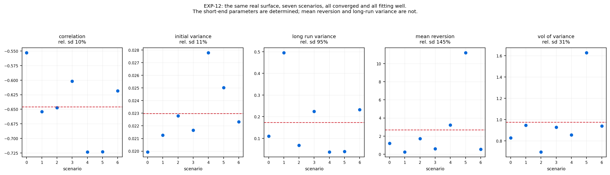

The residual surface shows where the model tracks the smile and where it cannot. Because
this surface was not generated by Heston, the residual is genuine model error and is
reported by strike and maturity rather than summarised into a single number.

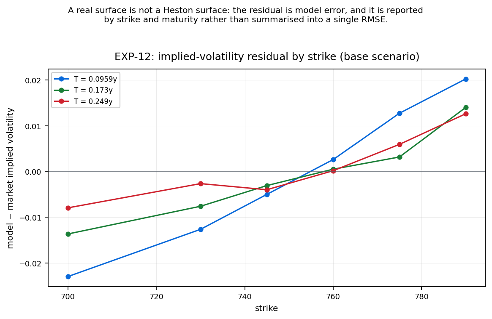

---

## 8. Warnings, limitations, and failure regions

Five experiments carry `warning`. **None of them malfunctioned.** Each ran to completion
and answered its question; the warning records that the answer carries a caveat which
changes what may legitimately be quoted from it. A `pass` tells a reader "quote this
freely" — so a caveat that limits quoting belongs in the status, not only in the prose.

**EXP-02 — the fit is pre-asymptotic, not wrong.** The full-range slopes (0.4974, 0.9838)
exclude their theoretical values while the asymptotic-window slopes (0.4996, 0.9957) cover
them, because the error is `C·Δt^k` only to leading order. Both fits are published. The
local orders climbing monotonically toward theory as the grid refines is the evidence that
this is arithmetic rather than a defect. [`CONVERGENCE-METHODOLOGY.md`](CONVERGENCE-METHODOLOGY.md) §3.

**EXP-07 — a refused fit, and an oracle that breaks.** Two distinct caveats.

*It refuses to fit the B=70 arm.* There the bias never clears its own across-seed noise. An
earlier run fitted it anyway and published an order of −0.19 with a 95% interval of
[−0.70, +0.33] — a confident-looking claim that the bias *grows* as the barrier is watched
more often, fitted entirely to six draws from zero. The record now reports it as unresolved,
which is what happened.

*It measures where its own reference stops working.* The Broadie–Glasserman–Kou continuity
correction predicts the discrete-monitoring bias in closed form. For down-barriers it lands
within noise, disagreeing at only **2 of 18** resolved cells without having been fitted to
the data. For up-barriers it is resolved as *wrong* at **23 of 24** — verified not to be a
sign error, since reversing the shift misses by an order of magnitude, but the correction's
own `o(1/√m)` remainder, made visible because an up-and-out call near the spot pays on
almost no paths and so has almost no noise to hide under. The record says not to use it as
an oracle in that geometry, and keeps it, because where an approximation breaks down is
itself a result.

The fitted monitoring orders also miss the theoretical 0.5 **from both sides** —
down-barriers low, up-barriers high. That two-sided miss is the argument that the miss is a
higher-order artefact rather than a correction to theory; a single-direction study would
have read its own miss as a signed correction and been wrong in a way no extra care within
that direction could expose. The PDE arm converges at order ~2 with five of eight cells
landing on 2.000 with tight intervals, the near-spot barriers being ragged at coarse grids
while still clearing the second-order floor the arm enforces.
[`BARRIER-MONITORING-METHODOLOGY.md`](BARRIER-MONITORING-METHODOLOGY.md) §5–8.

**EXP-10 — an order measured in one regime of two.** Full truncation's bias decays at order
1.09 where it is measurable. In the Feller-satisfying regime the bias is genuinely tiny —
below sampling noise at every step tested — so the record reports the decay order as
unresolved rather than fitting a slope to noise. "Full truncation converges at first order"
is therefore established for the regime that resolved and not for the other. Requiring only
*some* regime to resolve would let one measured order stand in for both.

**EXP-12 — a good fit that does not identify the parameters.** Detailed in §7. Every
scenario converged and fit; mean reversion still varies by 145% of its own mean and
long-run variance by 95%. The fitted values are usable for repricing the quotes they were
fitted to, and are not a measurement of the parameters themselves.

**EXP-14 — the interval is not automatically valid.** At N=2,000 with payoff skewness 17.3
the nominal 95% interval covers 87.75%. The option pays on a small fraction of paths, so
the payoff distribution is far from normal, the estimated standard error is itself
unreliable, and the interval comes out too narrow and slightly mis-centred. The degradation
is expected, explained, and confined to the small-sample skewed corner — and it is still a
warning, because a reader quoting a 95% interval in that regime would be quoting something
this experiment disproved. More paths fix it: the same cell at N=50,000 is defensible.

### Known failure regions

- **Deep out-of-the-money, short maturity.** The worst region for every sampled estimator.
  Few paths pay, so relative noise is largest; the likelihood-ratio Greek variance is at its
  worst here, and it is where the confidence interval under-covers.
- **Up-and-out barriers near the spot.** The continuity correction is not usable, and the
  contract's tiny price makes relative bias enormous.
- **Long-run Heston parameters from a short-dated surface.** `κ` and `θ` are not identified;
  see §7.
- **Plain Crank–Nicolson on a kinked payoff at coarse time steps.** Oscillates; use the
  Rannacher start-up, whose cost and benefit are both measured in EXP-06.

The general catalogue of self-deception modes this project guards against is
[`FAILURE-MODES.MD`](FAILURE-MODES.MD).

---

## 9. Conclusion

DiffusionWorks implements the models, instruments, and numerical methods a derivatives
pricing engine needs, in C++20, with the numerical core independent of interface,
plotting, and validation layers. The fifteen-experiment programme establishes that the
implementation converges at the rates theory predicts where the theory applies, agrees
across independent methods within sampling noise, and refuses rather than guesses at its
boundaries.

The results worth carrying away are the five warnings, because each is a place where the
obvious reading of a number would be wrong: a convergence order quoted from a full-range
fit that is pre-asymptotic; a closed-form barrier correction applied in a geometry where
this project measures it to be wrong at 23 of 24 cells; a discretisation order generalised
from the one regime that could resolve it; a calibrated parameter set read from a surface
that fits well and identifies almost nothing about the long run; and a confidence interval
trusted at a sample size where it covers 87.75% rather than 95%.

None of those is a defect in the engine. Each is a fact about the numerics that a project
reporting only its successes would not have found, and that this project's artifacts let a
reader check independently. Every number above regenerates from a committed record at
generator commit `3846fb3`, and
[`python/verify_claims.py`](../python/verify_claims.py) re-derives each of them from those
records mechanically rather than trusting this prose.

---

## Supporting documents

**Governing scope** — [`PROJECT-IDENTITY.MD`](PROJECT-IDENTITY.MD),
[`PROJECT-SPEC.MD`](PROJECT-SPEC.MD), [`PRODUCT-SPEC.MD`](PRODUCT-SPEC.MD),
[`DEFINITION-OF-DONE.MD`](DEFINITION-OF-DONE.MD), [`ROADMAP.MD`](ROADMAP.MD),
[`BUILD-PLAN.MD`](BUILD-PLAN.MD).

**Specification and design** — [`MATHEMATICAL-SPEC.MD`](MATHEMATICAL-SPEC.MD),
[`TECHNICAL-DESIGN.MD`](TECHNICAL-DESIGN.MD),
[`ARCHITECTURE-DECISIONS.MD`](ARCHITECTURE-DECISIONS.MD),
[`FLOATING-POINT-POLICY.md`](FLOATING-POINT-POLICY.md),
[`VERSION_CONTROL.md`](VERSION_CONTROL.md).

**Validation and testing** — [`VALIDATION-PLAN.MD`](VALIDATION-PLAN.MD),
[`TESTING-STRATEGY.MD`](TESTING-STRATEGY.MD), [`FAILURE-MODES.MD`](FAILURE-MODES.MD).

**Experiment methodology** — [`EXPERIMENT-CATALOG.MD`](EXPERIMENT-CATALOG.MD),
[`CONVERGENCE-METHODOLOGY.md`](CONVERGENCE-METHODOLOGY.md),
[`VARIANCE-REDUCTION-METHODOLOGY.md`](VARIANCE-REDUCTION-METHODOLOGY.md),
[`PDE-CONVERGENCE-METHODOLOGY.md`](PDE-CONVERGENCE-METHODOLOGY.md),
[`BARRIER-MONITORING-METHODOLOGY.md`](BARRIER-MONITORING-METHODOLOGY.md),
[`GREEKS-METHODOLOGY.md`](GREEKS-METHODOLOGY.md),
[`HESTON-PRICING-METHODOLOGY.md`](HESTON-PRICING-METHODOLOGY.md),
[`HESTON-CF-VALIDATION-METHODOLOGY.md`](HESTON-CF-VALIDATION-METHODOLOGY.md),
[`HESTON-SIMULATION-METHODOLOGY.md`](HESTON-SIMULATION-METHODOLOGY.md),
[`CALIBRATION-METHODOLOGY.md`](CALIBRATION-METHODOLOGY.md),
[`CROSS-METHOD-METHODOLOGY.md`](CROSS-METHOD-METHODOLOGY.md),
[`COVERAGE-METHODOLOGY.md`](COVERAGE-METHODOLOGY.md),
[`EDGE-CASES-METHODOLOGY.md`](EDGE-CASES-METHODOLOGY.md),
[`MULTITHREADING-METHODOLOGY.md`](MULTITHREADING-METHODOLOGY.md).

**Artifacts** — [`results/README.md`](../results/README.md) (reconciliation),
[`results/MANIFEST.json`](../results/MANIFEST.json) (inventory and checksums),
[`PHASE-13-READINESS-AUDIT.md`](PHASE-13-READINESS-AUDIT.md) (gap analysis and outcome).
